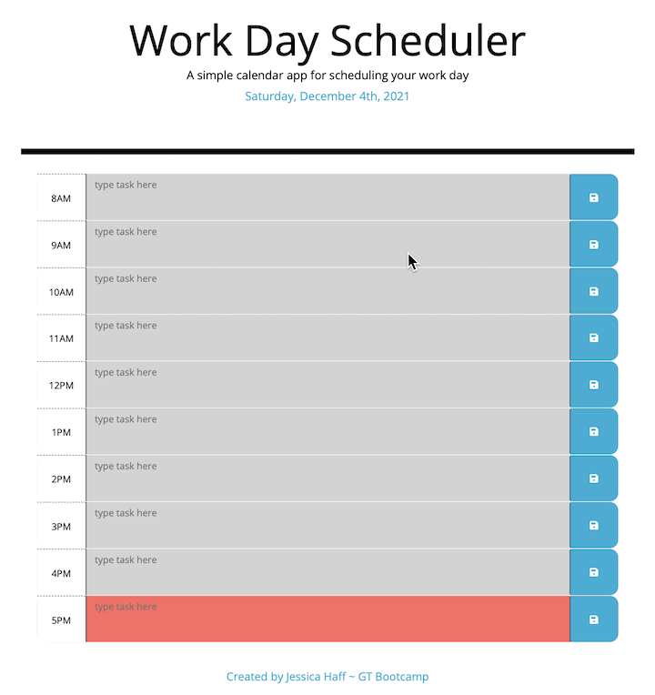

# third-party-APIs-work-day-scheduler-5

## 05 Third Party API's: Work Day Scheduler

### Description: 
#### This homework is a work day scheduler that was completed by Jessica Haff. The purpose of this homework was to use 3rd party API's to create a work day scheduler.
<br>
<br>

### Acceptance Criteria
```
GIVEN I am using a daily planner to create a schedule
WHEN I open the planner
THEN the current day is displayed at the top of the calendar
WHEN I scroll down
THEN I am presented with timeblocks for standard business hours
WHEN I view the timeblocks for that day
THEN each timeblock is color coded to indicate whether it is in the past, present, or future
WHEN I click into a timeblock
THEN I can enter an event
WHEN I click the save button for that timeblock
THEN the text for that event is saved in local storage
WHEN I refresh the page
THEN the saved events persist
```
<br>

### Links
[Link to Live Webpage](https://jesshaff.github.io/third-party-APIs-work-day-scheduler-5/)

[Link to Github Repository](https://github.com/jesshaff/third-party-APIs-work-day-scheduler-5)

<br>

### Screenshots
## -Working Code-
### Landing Page
